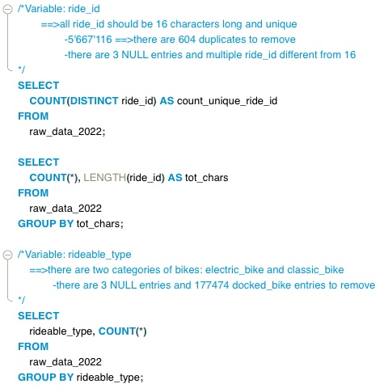
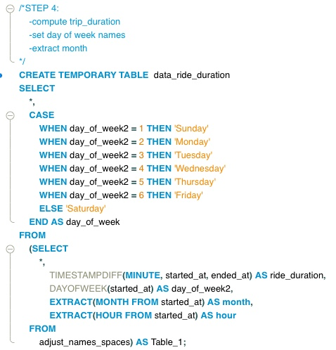

## Background
In this case study I am assumed to be a Jr. data analyst working in the marketing analytics team at Cyclist, a bike-share company in Chicago. Cyclist started in 2016 and since then the program has grown to a fleet of almost 6000 bikes that are locked into a network of little less than 700 stations around Chicago. The company offers both classic and electric bikes and has two types of membership: **casuals**, customers who buy single-trip pass or day pass; **members**, customer who purchase an annual pass. 

## Ask 
The analysis conducted by the finance department have determined that Members are the most profitable customers and have tasked the marketing department with organizing a campaign to convert Casuals customer into Members. The marketing department therefore needs to conduct an analysis based on historical data to asses: **What are the difference between Members and Casuals and how these can be exploited in the marketing campaign**.

## Prepare
The data is collected directly by Cyclist and for this analysis I restrict the sample to monthly data for 2022. The data is saved in 12 separated files as .csv. Note: date is first formatted in Excel through a macro in order to align with the default format of MySQL, i.e. YYYY-MM-DD HH:MM

The data collection team at Cyclist have outlined the main features of the dataset provided:
  * Each month contains every trip made during that period
  * 'docked bike' is the old label for 'classic bike'
  * Classic bike must start and end at a docking station, while electric bikes can start and end their trip anywhere as they include a locker. 
  * Data should contains only trip longer than one minute and shorter than one day. 

## Process
To combine, clean and perform a quick exploratory analysis I used SQL, in particular MySQL which has some small difference from BigQuery taught during the course. I first created the table *raw_data_2022* and then load the csv files one by one using the command LOAD DATA LOCAL INFILE that allow to import quickly large amount of data. Total number of obserations after import: 5'667'720. Total variables/columns: 13. 

#### Data Exploration 
I conduct a first exploration of the raw data in order to have a clearer idea of what needs to be done to prepare the data for the analysis. Main adjustment to do regard: 
  1. ride_id: it should be unique and 16 characters long 
  2. rideable_type: docked_bike need to be modified to 'classic_bike' as it was the old naming system. 
  3. start/end_station_name: there are 'test' stations included which need to be removed as well as wrong station names. 
  4. remove observations where bike type is 'classic' and start/end_station is NULL 
  5. member_casual: some entries are 7 characters long, which need to be adjusted to 6. 
  6. drop observations with NULL in latitude/longitude columns. 

Example of query: explore ride_id and rideable_type

Complete code: [Data Exploration](https://github.com/Stolemi/Google-Data-Analytics-Capstone-Project/blob/main/02_Data_Exploration.sql)

#### Data Cleaning
After the exploration, the steps are taken to clean the data. You can find the complete code here: Data Cleaning
Recap of data cleaning steps:
1. Remove rides for docked/classic bike that have no starting or ending station. 
2. Remove observations with NULL values. Note: keep those observations where start/end station is NULL and rideable_type = electric because these are then changed to "Locked Outside"
3. Change start/end station name = NULL with "Locked Outside"
4. Adjust member_casual: some are written as "member\r" 
5. Drop all observations where ride_id is not 16 characters long. Note: by dropping ride_id = NULL and length(ride_id) != 16 also duplicates in this variable are deleted. 
6. Drop observations where start/end stations are inconsistent or are test-stations. 

Furthermore, trip duration in minutes is computed and from starting date I extract the day of the week and the month. 

Example of a query: 

Complete code: [Data Cleaning](https://github.com/Stolemi/Google-Data-Analytics-Capstone-Project/blob/main/03_Data_Cleaning.sql)

## Analyze/Share
With the cleaned data the analysis can be conducted to answer the question: **What are the difference between Members and Casuals?** 
I first aggregate and analyze the data on SQL ([Exploratory Analysis](https://github.com/Stolemi/Google-Data-Analytics-Capstone-Project/blob/main/04_EDA.sql)) and then visualize the data with Tableau. I compute and plot the following metrics: 
* percentage of members and casuals 
* total rides (by member type and bike type)
* average ride duration by weekday and member/bike type 
* total rides by hour, weekday and month
* total rides by starting and ending station 

### Findings
1. Members account for 58.98% of total rides in 2022, while looking at the type of bike used by both membership types we can observe that Casuals slightly prefer electric bikes (53.7 vs. 46.3) while members use both type in similar way. 

  

                                                                                                                               
2. Next are visualized the average daily ride duration by member and bike type as well as the total rides by weekday. From these charts we can observe that Members use the bike service more often but for shorter rides (almost 13 minutes on average during the week), while Casuals usually utilize the bikes for longer trips and especially during weekends (22.32 minutes weekly average). The chart on the average trip duration by bike type shows as expected that electric bike are used for a shorter amount of time because they allow to travel to destination more quickly. 
**A first important conclusion is therefore that Members in general are people who ride to work during weekdays, while Casuals are people who use the service on weekends and for leisure.**

  

  

3. Visualizing data on total rides by hour of the day and by month we observe that, as suggested above, Members are probably for the most part people riding the bikes to and from work, as we have the most amount of rides around 8 a.m. and 5 p.m. With respect to Casuals, total rides follow and increasing path and are above average especially in the afternoon, reaching a peak at 5 p.m. which also supports the hypothesis that these are in general tourists or people using the service for leisure. With respect to the second chart, both Members and Casuals follow the same trajectory with late spring and summer months being when the service is most used. 

  

  

4. Lastly, I visualize the maps with the most popular starting and ending stations. We can observe that Casuals generally end their trips near parks, the lake or other turists attractions, while Members are grouped in the city center where offices and houses are located.   

  

  

